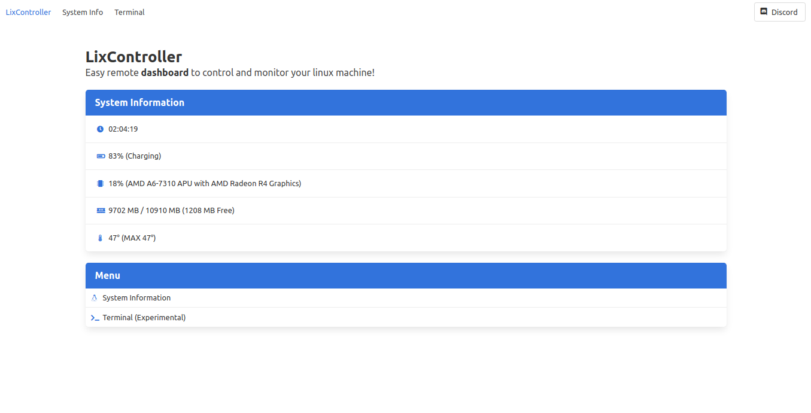

# LixController

Easy remote dashboard to control and monitor your linux machine!

[Discord](https://discord.gg/soon)

### Features
*   **System information** - CPU,RAM,TEMP,UPTIME
*   **Terminal(Experimental)** - Run terminal commands
*   **Shutdown/Restart** - Shutdown or restart the machine with one button click

<p align="center">
    
</p>

### Self-Hosting
**Configuration**
```
config.json
{
    "port": "port for the player server",
}
```
**Auth**
```
Enter in server.js and change the username and the password
If you want to add more users you can replace with

users: {
        'admin': 'supersecret',
        'adam': 'password1234',
        'eve': 'asdfghjkl',
    }
```
**Requirements**
```
node.js
A linux distribution
```
**Installing the LixController**

```
npm i
npm run start
```